# Lab1实验报告

## 一、实验思路

主要任务包括：完成`SysY`语言的词法分析和语法分析，构建抽象语法树，基于`Flex`和`Bison`框架实现

### 1. 词法分析(lexer.l)

- 实现的token类型包括：关键字、运算符、分隔符、标识符、常量、注释
- 实现要点
  - 正则表达式：定义标识符、数字常量的模式
  - 关键字优先：先匹配关键字，再匹配标识符
  - 多进制整数支持：通过正则表达式`0[0-7]+`和`0[xX][0-9a-fA-F]+`分别匹配八进制和十六进制整数，使用`strtol`进行进制转换
  - 忽略注释和空白：不返回token

### 2. 语法分析(parser.y)

- 采用自底向上的`LALR(1)`解析：使用Bison生成移进-归约解析器
- 消除歧义的设计：将`FuncType`直接内联到`FuncDef`规则中，避免`int IDENT`既能归约为变量声明又能归约为函数定义带来的冲突

### 3. AST构建

- 每种语法结构对应一个AST节点子类，继承自基类`Node`
- 使用`std::shared_ptr`管理子节点，通过`shared_cast`辅助函数在`Bison union`指针和智能指针之间进行切换

## 二、难点与亮点

**难点一**：shift/reduce冲突问题

- `int main(){...}`被错误解析为变量声明，bison在看到`int IDENT`后遇到`(`时选择shift(继续作为变量解析)而非 reduce(将int main归约为函数定义)
- 解决思路：分析发现冲突根源是`VarDecl:"int" VarDefs ";"`与`FuncDef: FuncType IDENT "(" ")" Block`共享前缀`int IDENT`，通过将`Functype`非终结符消除，让`int`和`void`直接出现在`FuncDef`规则中，使Bison在遇到`(`时可以区分两种情况。

**难点二**：多维数组的声明与访问

- `int a[2][2] = {1, 2, 3, 4};`和`array[0][0][0]`解析失败
- 解决方法
  - 不同维度的数组使用多条产生式去覆盖
  - 在`LVal`节点中添加`index`，`index2`,`index3`三个字段分别记录各个维度索引的表达式
  - 同时还要解决数组的初始化问题，引入了`InitVal`和`InitVals`规则支持`{}`初始化列表

**难点三**：函数形参数组

- 问题：我们在解析测试函数(`int f(int array[][2][2])`)
- 解决思路：在`FuncParam`中添加了 `is_array`,`aray_second_dim`和`array_third_dim`三个字段，通过`int IDENT "[" "]" "[" INTCONST "]" "[" INTCONST "]"`产生式匹配这种省略第一维的数组形参语法
- 这里我们灵活运用了`Bison`语义值：通过`shared_cast`模板函数和`take_string`辅助函数，解决了`Bison unio`无法直接使用`std::shared_ptr`的问题，实现了裸指针到智能指针的安全转换

## 三、心得体会

课堂上学习的词法分析、语法分析的理论知识都只是基础，实际动手才会发现，一个最简单的编译器需要注意的细节会更多，包括语法考虑的全面性、`flex`规则的顺序、`bison`冲突的处理策略等等，一个小的失误都会使实际的编译器无法正常工作。同时我还意识到我们要擅长使用工具输出，比如`bison`的`-v`参数生成的`.output`文件对非冲突产生的具体原因非常有帮助，能够清除看到每个状态的冲突项。整个`lab1`实验的增量式调试的过程也让我感受到了工程代码的先让基本框架work起来，再逐步去修改比一次性写完所有的要高效的多(本人就是从`26`分一路改到`43`分)

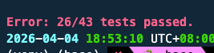
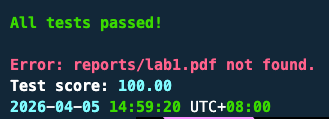

**AI使用截图**
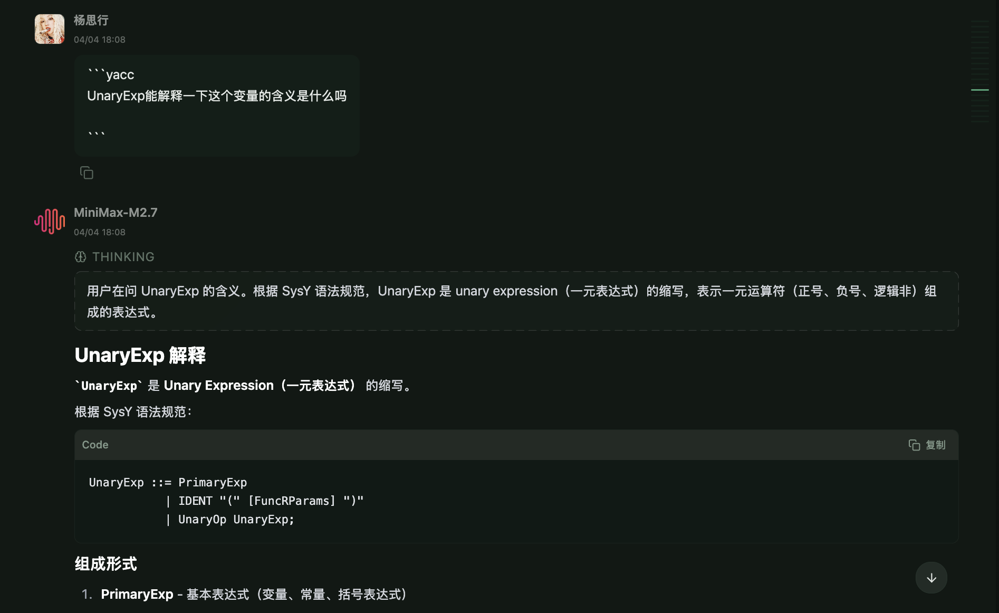
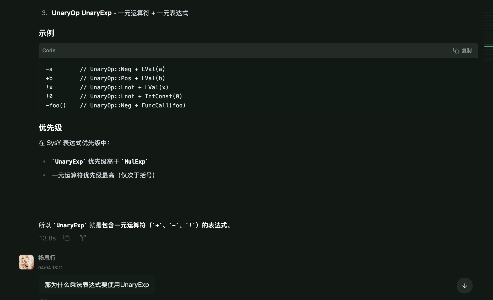
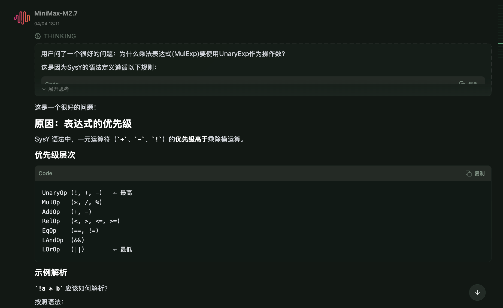
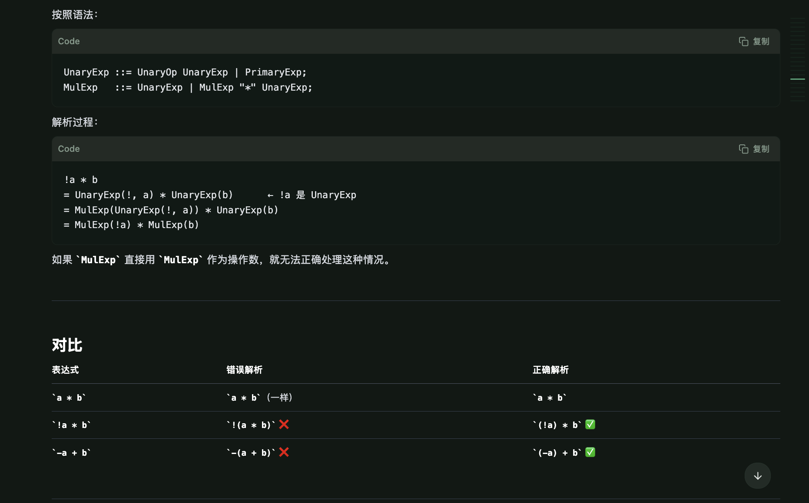
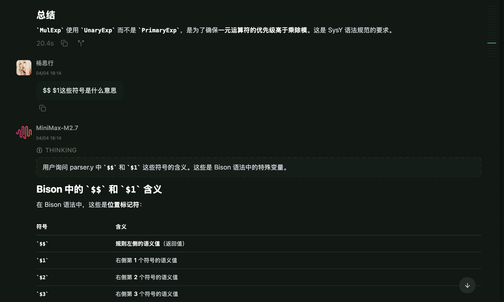
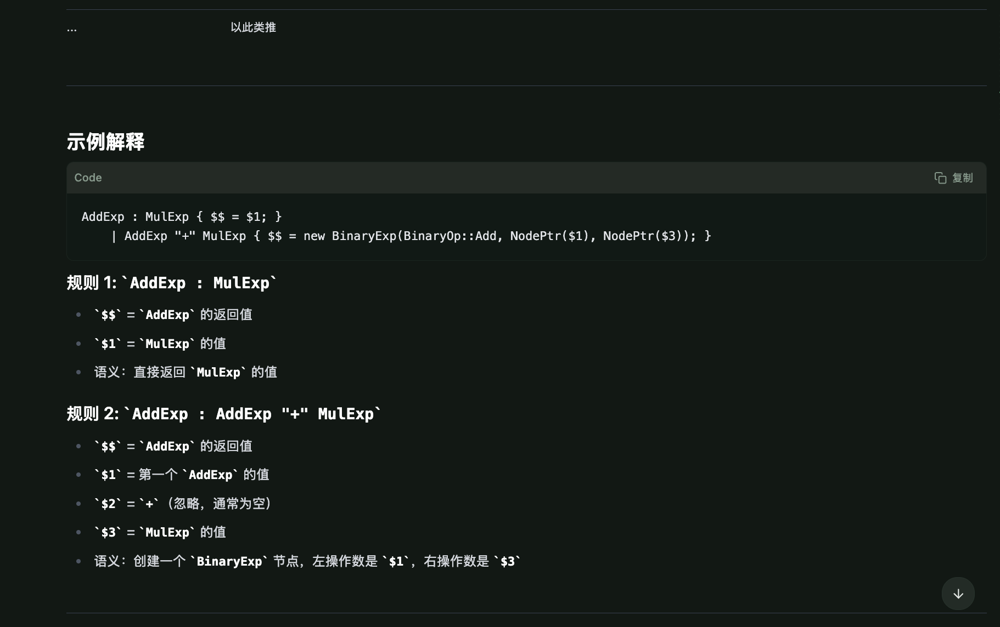
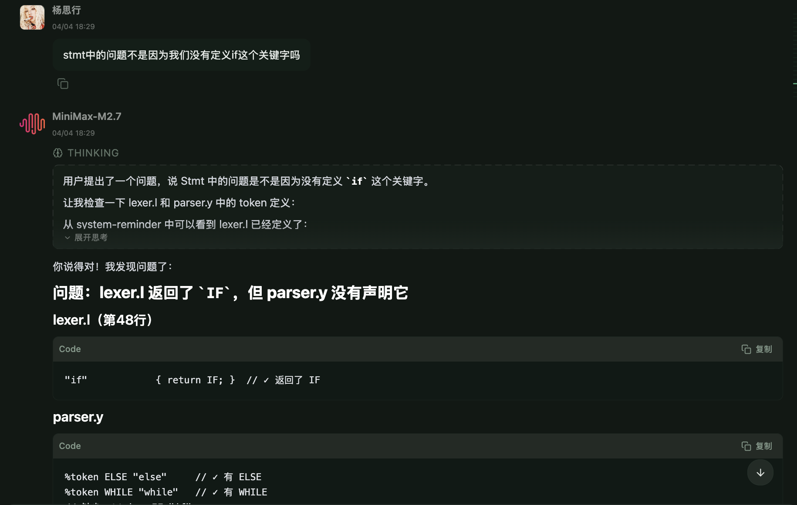
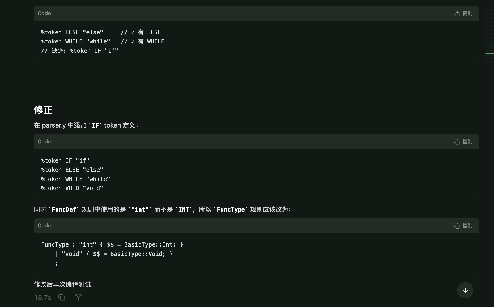
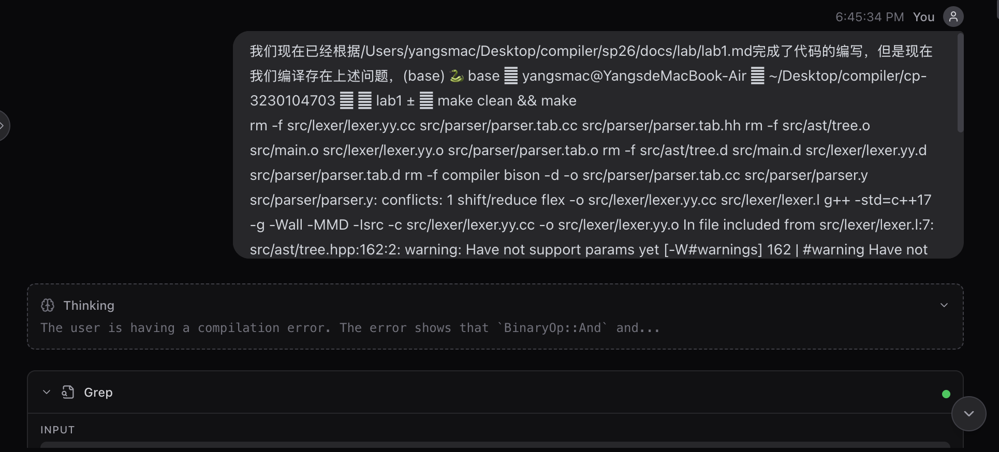
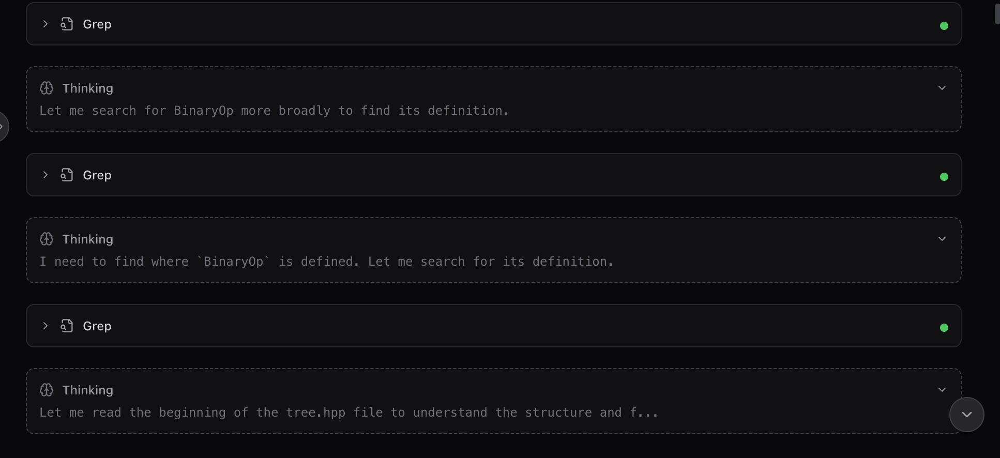
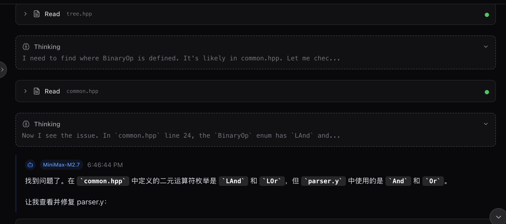
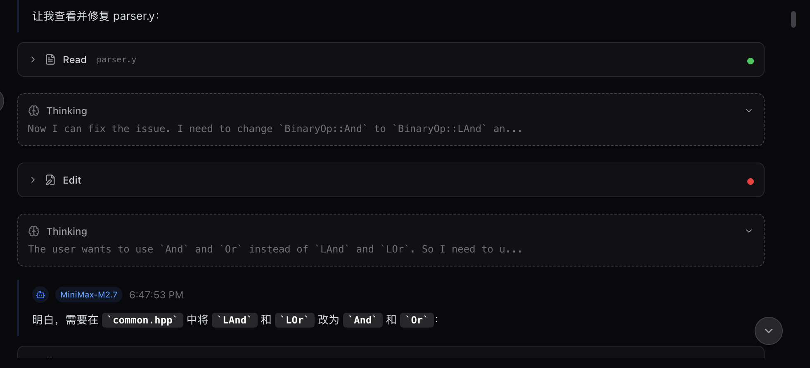
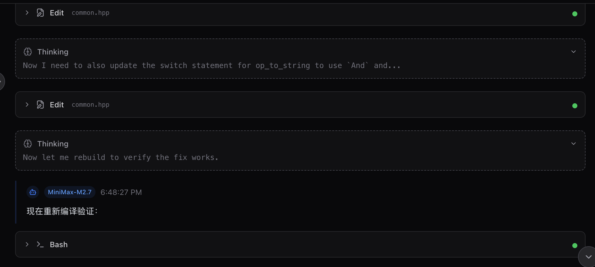
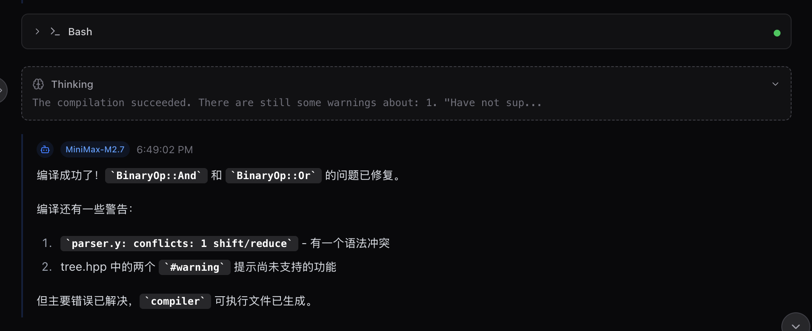