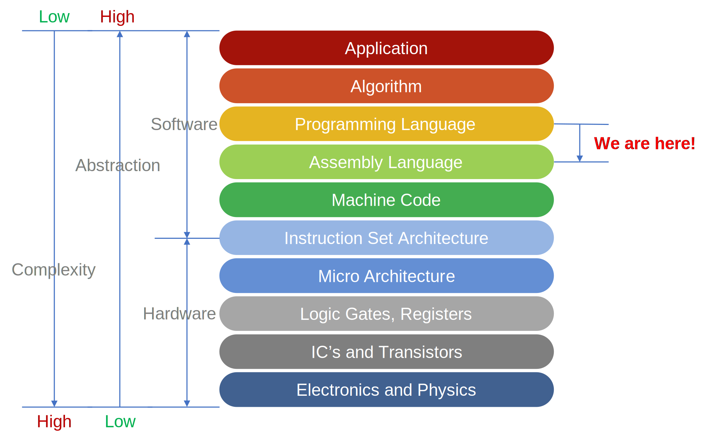

# 浙江大学编译原理课程实验 2026

!!! warning "须知"
    * 请勿散播你的解答：这是对他人的伤害。
        * **禁止**将实验代码上传到 GitHub、Gitee、CSDN 等公开平台。
        * 抄袭包括但不限于抄袭本教学班/其他教学班同学的代码，抄袭往届同学的代码，抄袭网上公开的代码。
        * 被抄袭包括但不限于主动提供代码给他人抄袭，在公开平台上公布代码而被抄袭，因未保护好代码被其他人拷贝与抄袭。
        * 提交的代码将被**严格查重**，如发现**抄袭/被抄袭**，该次实验均为 0 分。
    * 本实验指导可能存在错误，如果发现错误请及时在钉钉群中私戳助教。也欢迎在实验文档的评论区随意吐槽或提出问题，助教会定期查看并回答。
    * 本实验代码不禁止使用 AI 工具，如果你使用了 AI 工具，请在报告中**明确指出**使用了什么工具、如何使用。本实验**报告禁止使用 AI 工具**。具体参见[实验提交](#_5)部分的报告要求。

## 引言

在介绍实验之前，我们先回顾一下过去我们已经掌握的知识：

- **在编程语言之上**，我们学会了使用 C/C++ 等各种高级编程语言，从最基本的条件判断、循环、函数调用，到复杂的数据结构和算法设计，我们一步步提升自己的编程能力。同时，我们也接触了操作系统、数据库等系统软件，理解了它们是如何高效调度资源、管理数据，并支撑起现代计算机系统的。可以说，这部分学习让我们掌握了如何用编程去解决实际问题。
- **在汇编语言之下**，我们也探索了计算机硬件的世界。从布尔逻辑到组合电路，从时序单元到流水线架构。我们理解寄存器如何暂存数据，ALU 如何执行运算，控制单元如何解码指令，弄清楚了计算机是如何执行一条指令的。我们还学过机器码，知道它其实就是一串二进制数据，而汇编语言则是它的“翻译版本”，让人类能稍微看懂一点。通过这些学习，我们对计算机底层的运行机制有了更深的理解。

现在，在计算机架构的知识体系中，只剩下最后一块拼图。掌握了它，我们就能串联起从软件到硬件的完整链条。这块拼图就是——**编译原理**。

### 我们为什么要学习编译原理

在帖子 [Rich Programmer Food](http://steve-yegge.blogspot.com/2007/06/rich-programmer-food.html) 里，Steve Yegge 讲了一个很有意思的观点：

!!! quote "If you don’t know how compilers work, then you don’t know how computers work. If you’re not 100% sure whether you know how compilers work, then you don’t know how they work."
    如果你不知道编译器是怎么工作的，那你就不算真正懂计算机。如果你不能 100% 确定自己明白编译器的原理，那其实你是不懂的。

他还说了句很扎心的话：

!!! quote "If you don’t take compilers then you run the risk of forever being on the programmer B-list: the kind of eager young architect who becomes a saturnine old architect who spends a career building large systems and being damned proud of it."
	如果你不学编译器，那你可能会一直处于程序员的二线梯队。那些年轻时满怀激情的架构师，最后往往会变成年纪渐长、但只能靠构建大系统为荣的“老架构师”。

虽然这篇文章有点偏激，但是确实某种程度上反映了现实：**编译问题无处不在。**

喜欢前端开发的同学肯定知道 React、Vue 之类的框架。这些工具本质上都是编译器。React 把 JSX 转为 HTML 和 JS；Vue 的 `.vue` 文件会编译出 HTML、JS 和 CSS。

喜欢搞 AI 的同学肯定对 Python 以及 CUDA 有所了解。Python 的即时编译器帮助高效执行代码，而 CUDA 则是把高级的 CUDA C/C++ 代码编译成 GPU 可以执行的指令。

不难看出，编译原理不仅是连接高级语言和计算机硬件的桥梁，也是计算机系统运行效率优化的关键，编译问题无处不在。Ras Bodik 曾经说过一句让人印象深刻的话：

!!! quote "Don’t be a boilerplate programmer. Instead, build tools for users and other programmers. Take historical note of textile and steel industries: do you want to build machines and tools, or do you want to operate those machines?"
	不要做流水线上的程序员。相反，去为用户和其他程序员打造工具。回头看看纺织和钢铁工业的历史：你是想制造机器，还是只想操作机器？

所以，编译原理真的很重要。如果你对编译原理产生了浓厚的兴趣，也欢迎你阅读以下资料来自学：

- [Compiling to Assembly from Scratch](https://keleshev.com/compiling-to-assembly-from-scratch/)：它讲了如何用 TypeScript 写一个小型的 ARM32 代码生成器。通过用解析器组合器（parser combinator）解析代码，再用访问者模式（visitor pattern）生成 ARM32 汇编指令。等你看完这本不到 200 页的小书，你就能写一个把 JavaScript 子集编译成 ARM32 汇编的简易编译器了。
- [Crafting Interpreters](https://craftinginterpreters.com/)：这本书前半部分用 Java 写一个基于树的解释器，后半部分用 C 写一个为名叫 Lox 的语言服务的字节码虚拟机。Bob Nystrom 的讲解非常细致，代码和文字解释清晰易懂。
- [ChibiCC](https://github.com/rui314/chibicc)：这个项目是 Mold（新 LLVM 链接器）的作者 Rui Ueyama 写的一个 C 编译器项目。这个项目基于 Ghuloum 的论文 [An Incremental Approach to Compiler Construction](http://scheme2006.cs.uchicago.edu/11-ghuloum.pdf)，主张通过增量式开发，一步步构建功能完整的编译器。Rui 的代码非常干净，每次提交的功能都很明确，提交信息也详细解释了新加了什么功能。虽然没有配套教程，但通过看代码差异（diff）来理解，确实是学编译器的好方法。

### 前置“课程”

理论上，想要完成编译原理的课程实验，不需要任何前置知识，只要你会写代码就行。但还是希望你能先学习以下内容：

- [The Missing Semester of Your CS Education](https://missing.csail.mit.edu/)（中文版在[这里](https://missing-semester-cn.github.io/)）：这门课程由 MIT 的学生和教授共同制作，内容涵盖了一些在专业课程中不会直接教授的实用技巧，比如 shell、版本控制、调试、性能分析等。
- [How To Ask Questions The Smart Way](http://www.catb.org/~esr/faqs/smart-questions.html)（中文版在[这里](https://github.com/ryanhanwu/How-To-Ask-Questions-The-Smart-Way/blob/main/README-zh_CN.md)）：这是一篇由 Eric S. Raymond 和 Rick Moen 合作撰写的文章，教你如何提问才能得到高质量的回答。在实验中遇到问题想要提问时，你最好先看看这篇文章，学习一下如何更好更高效地提问。比如，当你遇到问题时，先尝试 **RTFM**（**R**ead **T**he "**F**riendly" **M**anual）、**STFW**（**S**earch **T**he "**F**riendly" **W**eb），当然，现在还可以 **ATFAI**（**A**sk **T**he "**F**riendly" **AI**）。

相信无论是在实验中还是在未来的工作中，这些技巧都会让你事半功倍。

## 实验介绍

!!! quote "What I cannot create, I do not understand. -- Richard Feynman"

既然这门课程叫做编译原理, 那么我们的大作业自然就是实现一个编译器。
在该实验中，你将会实现一个简单的编译器，将 SysY 语言的源代码最终转化为 RISC-V 汇编代码。

具体来说整个实验分为五个小实验：

* **Lab 0: 环境配置与测试用例编写**：配置实验环境，学习 SysY 语法，为你的编译器编写测试用例。
* **Lab 1: 词法分析与语法分析**：实现词法分析和语法分析，将源代码转化为抽象语法树。
* **Lab 2: 语义分析**：实现符号表，基于抽象语法树进行语义分析。
* **Lab 3: 中间代码生成**：把分析后的抽象语法树转化为实验定义的中间代码。
* **Lab 4: 目标代码生成**：将中间代码转化为 RISC-V 32 汇编代码。

下图展示了我们是如何将阶乘函数转化为 RISC-V 汇编代码的：

{ style="filter: invert(1) hue-rotate(180deg)" }

<!-- !!! tip "课程实验与课程内容强相关，希望大家能够认真完成实验，加深对课程内容的理解。" -->

对于学有余力并对编译器感兴趣的同学，我们还提供了三个 Bonus 实验：

* **Bonus 1: Lexer & Parser, DIY!**：自己实现词法分析器和语法分析器，将 SysY 语言的源代码转化为抽象语法树。
* **Bonus 2: 支持更多语言特性**：你可以自由的扩展当前的语法，实现更多的功能。
* **Bonus 3: 编译优化**：通过多种方式提升 SysY 程序在目标硬件平台的执行时间或降低编译得到的可执行文件大小。

## 实验提交

我们使用 ZJU Git 的 CI 服务进行自动测试，助教会给每个人创建一个仓库，你需要将代码提交到这个仓库中。我们使用的 CI 配置文件为 [`tool/test.yml@Compiler/sp26`](https://git.zju.edu.cn/compiler/sp26/-/blob/main/tool/test.yml)，这个文件会告诉 CI 服务如何测试你的代码。每个 lab 和 bonus 都需要单独创建一个分支，分支名为 `labX` 或 `bonusX`，其中 `X` 为实验编号。你可以使用 `git checkout -b <branch-name>` 来创建一个新的分支。CI 会在你 push 代码时根据分支名自动运行测试，并且检查是否包含对应的 PDF 报告。只有对应实验的所有测试点全部通过，且包含对应的 PDF 报告，才能通过 CI 测试。

我们只接受 PDF 格式的报告，请将每个实验的报告放置在对应分支的 `reports/<branch-name>.pdf` 中，例如 Lab 1 的报告应该放在 `reports/lab1.pdf`。实验报告正文**不得超过 3 页**，内容包括:

- **实现思路**：描述你完成实验的思路和方法，重点描述你是如何实现的。请不要照搬实验指导。
- **难点与亮点**：你在实现过程中遇到的难点？说说你是如何解决这些难点的；你实现中的亮点？重点描述你的实现中的亮点，你认为最个性化、最具独创性的内容，避免大段地向报告里贴代码。
- **心得体会（20%）**：做完这次实验后，有什么心得体会？说说你完成实验后的真实感悟、避坑指南或吐槽。
- **附加内容（不计入页数）**：
    - **建议（可选）**：你对本次实验有什么建议和想法？你可以提出对实验设计的建议，指出实验指导里描述含糊的地方，或者是对实验的任何想法。
    - **借鉴声明**：如果你复用借鉴了参考代码或其他资源，请明确写出你借鉴了哪些内容。如果你没有上述情况，也请在报告中明确声明。**即使你声明了代码借鉴，你也需要自己独立认真完成实验。**
    - **AI 工具使用记录**：如果你使用了 AI 工具辅助实验，请在报告中明确指出使用了什么工具、如何使用。例如：
        - 问答类（ChatGPT 等）：附上你与 AI 工具的对话截图或文字记录。
        - Tab Completion 类（如 Cursor Tab 等）：明确指出使用工具名称。
        - Agent 类（Claude Code 等）：请让 Agent 生成代码时一同生成 update notes，并在提交代码库保留所有 Agent 生成的辅助文档（例如 `AGENT.md`），在报告中附上相关截图或文字记录。
        - 上述 AI 工具使用的完整记录可存放于仓库的 `reports/appends/lab1` 文件夹中，并在实验报告中简要说明。

!!! danger "实验报告存在以下情况的，将由助教现场验收，并相应扣分"
    - 若实验报告中**缺乏实现思路**或**未真实描述 AI 工具使用情况**，将由助教现场验收，并相应扣分。
    - 实验报告**禁止使用 AI**，包括但不仅限于直接生成报告内容、润色等。提交的报告将会使用 AI 检测工具进行检测。若 AI 生成的内容占比过高，或者检测出明显的 AI 生成痕迹，将由助教现场验收，并相应扣分。

<!-- !!! danger "若实验报告中**缺乏实现思路**或**未真实描述 AI 工具使用情况**，将由助教现场验收，并相应扣分。"

!!! danger "实验报告**禁止使用 AI**，包括但不仅限于直接生成报告内容、润色等。提交的报告将会使用 AI 检测工具进行检测。若 AI 生成的内容占比过高，或者检测出明显的 AI 生成痕迹，将由助教现场验收，并相应扣分。" -->

<!-- - 你的程序实现了哪些功能？简要说明如何实现这些功能。
- 你的实现中的亮点？重点描述你的实现中的亮点，你认为最个性化、最具独创性的内容，避免大段地向报告里贴代码。
- （不计入总页数，不计入分数）如果你使用了 AI 工具，请在报告中明确指出使用了什么工具、如何使用。如果你复用借鉴了参考代码或其他资源，请明确写出你借鉴了哪些内容。**如果你没有上述情况，也请在报告中明确声明。即使你声明了代码借鉴，你也需要自己独立认真完成实验。**
- （可选，不计入总页数，不计入分数）你对本次实验有什么建议和想法？你可以提出对实验设计的建议，指出实验指导里描述含糊的地方，或者是对实验的任何想法。 -->

## 测试与评分

我们的测试文件基于[全国大学生计算机系统能力大赛编译系统设计赛](https://compiler.educg.net/#/)测试修改而来，主要是在语法分析和语义分析中添加了大量**不**符合规范的测试用例，对你的编译器进行测试。

<!-- 我们的所有测试都是公开且本地可运行的，目前不设置隐藏测试，具体运行方式见后文。 -->

各实验占比和截止时间如下：

| 实验名称       | 占比 | 截止时间          |
| -------------- | ---- | ----------------- |
| Lab 0: 环境配置与测试用例编写 | **10%**   | **2026-03-15 23:59**（第 2 周周日） |
| Lab 1: 词法与语法分析 | **30%**  | **2026-04-19 23:59**（第 7 周周日） |
| Lab 2: 语义分析    | **30%**  | **2026-05-10 23:59**（第 10 周周日） |
| Lab 3: 中间代码生成 | **15%**  | **2026-05-31 23:59**（第 13 周周日） |
| Lab 4: 目标代码生成 | **15%**  | **2026-06-21 23:59**（第 16 周周日） |

Lab 1 至 Lab 4 需要提交实验报告，实验报告的分数占比为当次实验的 10%，剩余 90% 为实验测试成绩。实验测试成绩为 CI 测试结果显示的测试成绩，即通过的测试用例百分比。对于实验 2、3、4，除了公开的测试仓库中的测试用例之外，我们还设置了一些隐藏测试用例，最终的测试成绩为公开测试成绩和隐藏测试成绩的加权平均，权重分别为 80% 和 20%。

所有代码和报告均提交至 ZJU Git 的对应仓库，请务必按照上文要求提交，否则可能导致无法自动评分。

每一个实验截止后我们会将对应分支的 Push 权限关闭，因此，请你在完成实验后及时推送到远程仓库的对应分支。如果你在截止日期后仍然想要提交该实验的代码，请联系助教补交。

**在截止日期后，每迟一天该实验总分扣 10%，扣完为止。**

在完成 Lab 4 的基础上，我们还提供了 3 个 Bonus 实验（Bonus 1-3）。这些附加实验的指导内容相对简略，需要你在理解基础实验的前提下进行自主探索。完成 Bonus 实验后，你同样需要撰写一份简短的实验报告，**页数不限**，以便助教了解你的实现过程与结果。Bonus 的提交截止日期为 **2026-6-24**（考试周前一天）。

如果你希望改进实验测试、贡献优质测试用例，可以参与 Bonus 0。通过向 [sp26-tests 仓库](https://git.zju.edu.cn/compiler/sp26-tests) 提交测试用例，并成功让你的 Merge Request 被合并，也可以获得 Bonus 加分。